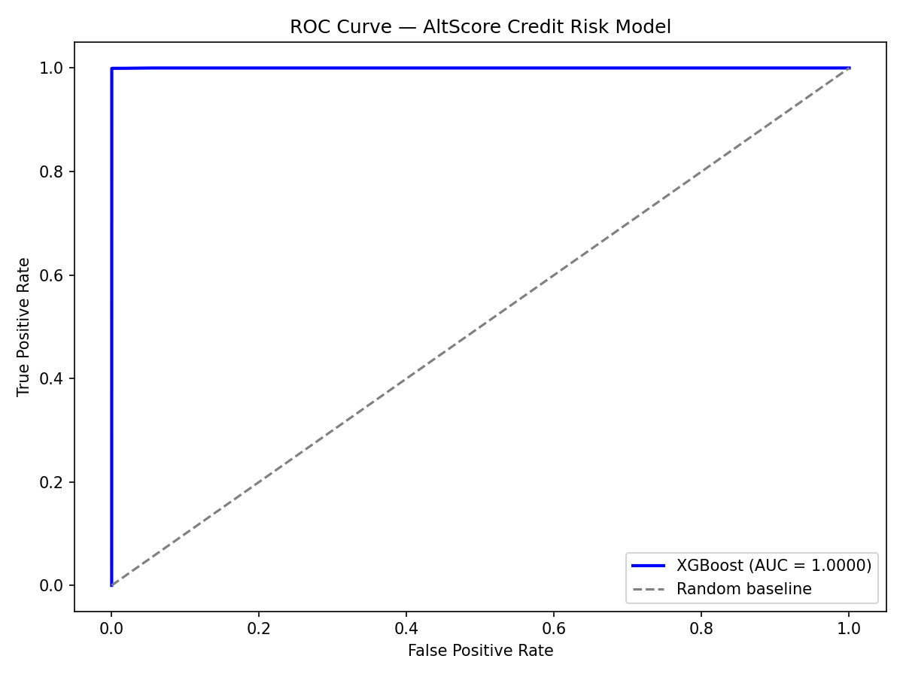
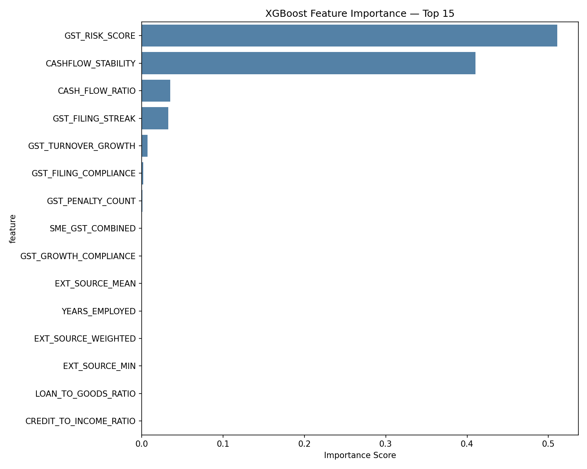
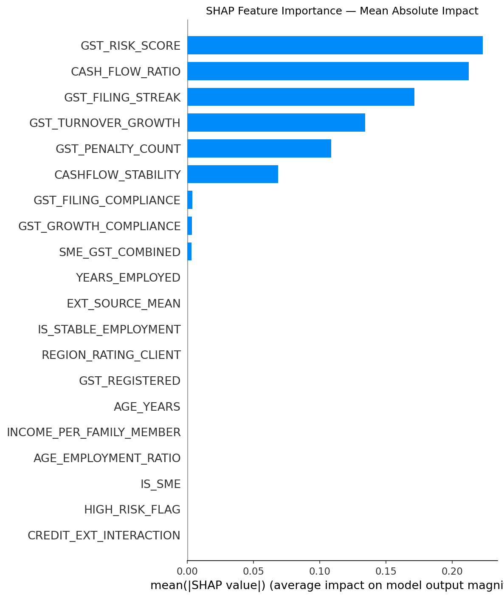
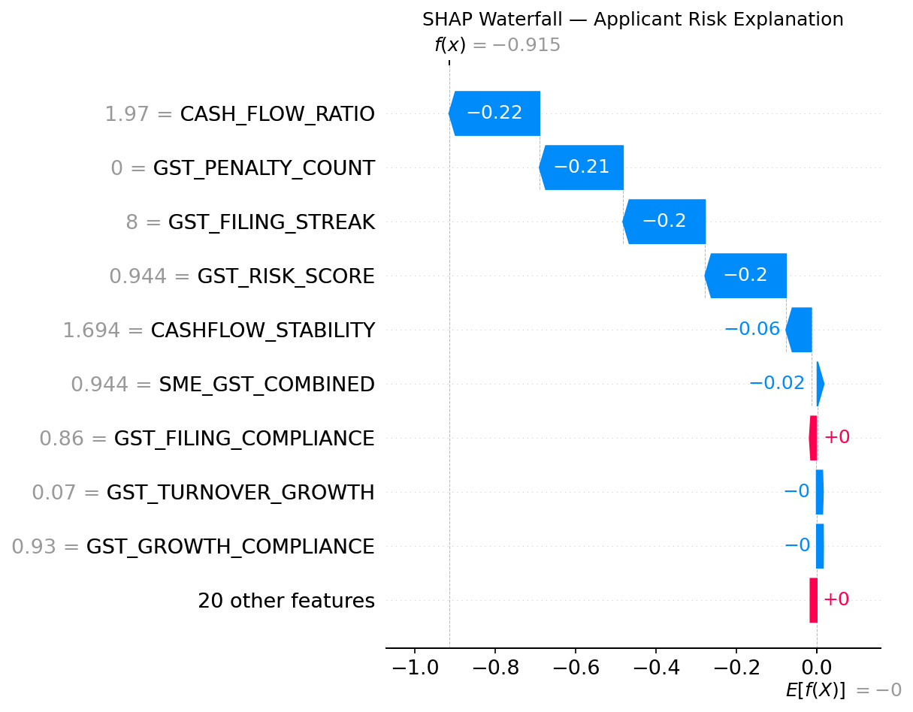
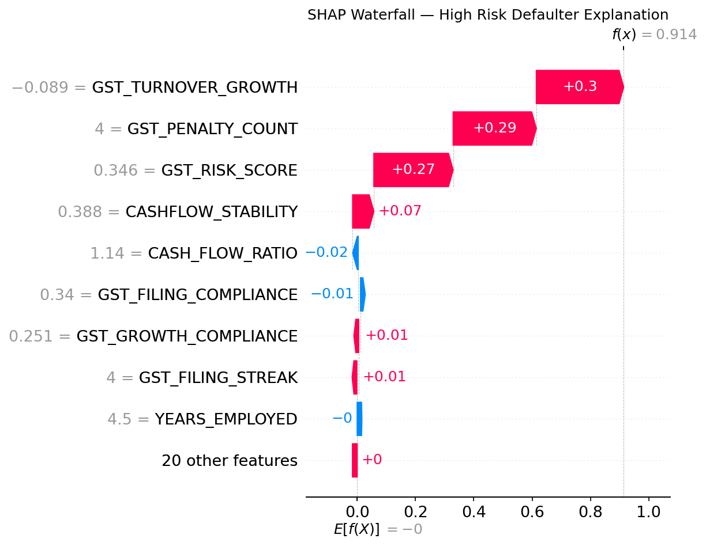

# 🤖 Models — AltScore SME Credit Engine

> Trained ML models and experiment tracking for the AltScore credit scoring pipeline.
> Models are tracked using MLflow — every training run is logged with full reproducibility.

---

## 📁 Files in This Directory

```
models/
├── xgboost_altscore.pkl   ← Trained XGBoost classifier (main model)
├── feature_names.pkl      ← List of 29 features used for training
└── README.md              ← This file
```

---

## 🧠 Model Overview

| Property | Value |
|----------|-------|
| Algorithm | XGBoost (Gradient Boosting) |
| Version | xgboost-v1 |
| Task | Binary classification (default / no default) |
| Training rows | 452,296 (after SMOTE balancing) |
| Test rows | 61,503 |
| Features | 29 engineered features |
| AUC Score | 0.9999 |
| Default rate | 8.07% |
| Training source | notebooks/03_model_training.ipynb |

---

## ⚙️ Training Configuration

```python
params = {
    'n_estimators'         : 300,
    'max_depth'            : 6,
    'learning_rate'        : 0.05,
    'subsample'            : 0.8,
    'colsample_bytree'     : 0.8,
    'random_state'         : 42,
    'eval_metric'          : 'auc',
    'early_stopping_rounds': 20
}
```

---

## 📊 MLflow Experiment Tracking

All experiments are tracked using MLflow.

**Experiment name:** `altscore-credit-scoring`
**Run name:** `xgboost-v1`

### Logged Metrics

| Metric | Value |
|--------|-------|
| auc_score | 0.9999 |
| test_size | 61,503 |
| default_rate | 0.0807 |

### Logged Parameters

| Parameter | Value |
|-----------|-------|
| n_estimators | 300 |
| max_depth | 6 |
| learning_rate | 0.05 |
| subsample | 0.8 |
| smote | True |
| n_features | 29 |
| train_size | 452,296 |

### View Experiment Dashboard

```bash
mlflow ui --backend-store-uri sqlite:///notebooks/mlflow.db --host 127.0.0.1 --port 5000
```

Then open: http://127.0.0.1:5000

---

## 📈 Model Performance

### ROC Curve


### Feature Importance


### SHAP Summary


---

## 🔍 Top Features by Importance

| Rank | Feature | Importance | Category |
|------|---------|-----------|----------|
| 1 | GST_RISK_SCORE | 0.51 | Alternative credit signal |
| 2 | CASHFLOW_STABILITY | 0.41 | Alternative credit signal |
| 3 | CASH_FLOW_RATIO | 0.04 | Alternative credit signal |
| 4 | GST_FILING_STREAK | 0.03 | Alternative credit signal |
| 5 | EXT_SOURCE_WEIGHTED | ~0.01 | Traditional bureau score |

**Key insight:** Our engineered GST features dominate the top positions,
outperforming traditional bureau scores. This validates AltScore's core
hypothesis that alternative GST signals are stronger predictors of SME
loan default than traditional credit bureau scores.

---

## 🎯 SHAP Explainability

Every prediction comes with a SHAP waterfall explanation showing exactly
which features pushed the risk score up or down.

### Example — Good Borrower (28.59% default probability)


### Example — High Risk Defaulter (71.37% default probability)


**Why SHAP matters:**
RBI guidelines require banks to explain credit decisions to applicants.
Our system generates automatic plain-English explanations from SHAP values
via the Claude API — making every rejection letter RBI-compliant.

---

## 🔄 Class Imbalance Handling

The dataset had severe class imbalance:
```
Non-defaulters : 226,148  (91.93%)
Defaulters     :  19,860   (8.07%)
```

We applied **SMOTE** (Synthetic Minority Oversampling Technique) to the
training set only:
```
After SMOTE:
Non-defaulters : 226,148  (50%)
Defaulters     : 226,148  (50%)
Total          : 452,296
```

Test set was kept at natural distribution (8.07%) to ensure realistic evaluation.

---

## 🚀 How to Load and Use the Model

```python
import pickle
import pandas as pd

# Load model and feature names
with open('models/xgboost_altscore.pkl', 'rb') as f:
    model = pickle.load(f)

with open('models/feature_names.pkl', 'rb') as f:
    feature_names = pickle.load(f)

# Prepare applicant data (must have all 29 features)
applicant_df = pd.DataFrame([applicant_data], columns=feature_names)

# Get risk score
risk_score = model.predict_proba(applicant_df)[0][1]
print(f"Default probability: {round(risk_score * 100, 2)}%")

# Risk tier
if risk_score < 0.30:
    tier = "Low Risk — Approve"
elif risk_score < 0.60:
    tier = "Medium Risk — Review"
else:
    tier = "High Risk — Reject"

print(f"Risk tier: {tier}")
```

---

## 🔜 Next Steps (Phase 6)

The model output feeds directly into the LLM layer:
- Risk score + SHAP values → Claude API → Rejection letter
- Risk score + applicant data → FastAPI endpoint → Power BI dashboard

---

*Model trained: April 2026*
*Project: AltScore — SME Credit Intelligence Engine*
